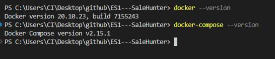
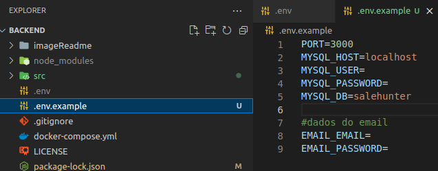
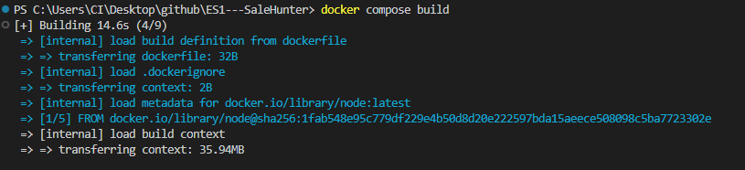

# SaleHunter - BackEnd

BackEnd para o projeto SaleHunter de engenharia de software - UTFPR-2023/1 
</br>
</br>

# 🔧 Instalação Docker e Docker compose
Para a utilização será necessário a instalação do [docker](https://www.docker.com/products/docker-desktop/) e [docker compose](https://docs.docker.com/compose/)



# 🔧 Clonando repositorio

Já pode ser clonado o repositório para sua máquina 
```
git clone Link-do-Repositorio
```

# 🔧 Configurando os arquivos

Dentro do arquivo existe um **.env.exemplo** que deve ser copiado em um **.env** dentro dele deve ser colocado as informações do banco de dados e da porta da api, caso queira usar o contêiner de banco de dados do docker deve ser usado conforme o exemplo: 



Então deve ser adicionado o seu **MYSQL_USER** e **MYSQL_PASSWORD**, caso esteja usando o padrão será **root** nos dois


# 🔧 Executando o Sistema

Assim que os arquivo estiver configurado basta apenas executar os comandos do docker

```
docker compose up --build
```



Com isso o mysql ja vai está rodando em sua maquina.

Agora para iniciar o sistema utilize

```
npm install
```
```
npm run dev
```

Com isso o sistema já vai estar rodando em http://localhost:3000


# Documentação 


# User

## /register
Utilizado para cadastrar um usuarios 

Type: <strong>POST</strong>

Dados esperado
```
um JSON:

{
	"name":"username" - string
	"email": "useremail" - string
	"password": "usersenha" - string
}
```

## /login
Utilizado para login do usuario


Type: <strong>POST</strong>

Dados esperado
```
um JSON:

{
	"email": "useremail" - string
	"password": "usersenha" - string
}
```

## /recoverpassword
Utilizado para recuperar a senha do usuarios 


Type: <strong>POST</strong>

Dados esperado
```
um JSON:
{
	"email": "useremail" - string
}
```

## /resetpassword
Utilizado para resetar a senha do usuarios 

Type: <strong>POST</strong>

Dados esperado
```
um JSON:
{
	"email": "useremail" - string
	"token": "usertoken" - string
	"password": "userpassword" - string
}
```
## /getuser
Utilizado para selecionar um usuario 

Type: <strong>GET</strong>

Dados esperado
```
um JSON:
{
	"token": "usertoken" - string
}
```
## /getallusers
Utilizado para selecionar todos os usuarios

Type: <strong>GET</strong> 

Dados esperado
```
NULL
```

## /updateuser
Utilizado para atualizar os dados de um usuario 

Type: <strong>PUT</strong>

Dados esperado
```
um JSON:
{
	"token": "usertoken" - string
	"name" : "newnameuser" - string
}
```

## /deleteuser
Utilizado para deletar um usuario 

Type: <strong>DELETE</strong>

Dados esperado
```
um JSON:
{
	"token": "usertoken" - string
}
```

# Store

Type: <strong>POST</strong>

## /registerstore
Utilizado para cadastrar uma loja

Dados esperado
```
um form-data:

"name": "nameStore" - string
"describe": "describreStore" - string
"link": "linkStore" - string
"image": "logoStore" - file(png/jpeg)

```

## /getonestore

Type: <strong>POST</strong>

Utilizado para selecionar uma unica loja 

Dados esperado
```
um JSON:
{
"name": "nameStore" - string
}
```

## /getallstore
Utilizado para selecionar todas as loja 

Type: <strong>GET</strong> 

Dados esperado
```
NULL
```

## /updatestore
Utilizado para atualizar os dados da loja

Type: <strong>PUT</strong> 

Dados esperado
```
um form-data:

"name": "nameStore" - string
"newname": "nameStore" - string
"describe": "describreStore" - string
"link": "linkStore" - string
"image": "logoStore" - file(png/jpeg)
```

## /deletestore
Utilizado para deletar a loja

Type: <strong>DELETE</strong> 

Dados esperado
```
"name": "nameStore" - string
```

# game

Type: <strong>POST</strong>

## /registergame
Utilizado para cadastrar um jogo

Dados esperado
```
um form-data:

"name": "namegame" - string
"describe": "describregame" - string
"link": "linkgame" - string
"image": "logogame" - file(png/jpeg)

```

## /getonegame

Type: <strong>POST</strong>

Utilizado para selecionar um unico jogo

Dados esperado
```
um JSON:
{
"name": "namegame" - string
}
```

## /getallgame
Utilizado para selecionar todas os jogos

Type: <strong>GET</strong> 

Dados esperado
```
NULL
```

## /updategame
Utilizado para atualizar um jogo 

Type: <strong>PUT</strong> 

Dados esperado
```
um form-data:

"name": "namegame" - string
"newname": "namegame" - string
"describe": "describregame" - string
"link": "linkgame" - string
"image": "logogame" - file(png/jpeg)
```

## /deletegame
Utilizado para deletar um jogo 

Type: <strong>DELETE</strong> 

Dados esperado
```
um JSON:
"name": "namegame" - string
```


# Relação game com loja


## /relationgametostores

Type: <strong>POST</strong>

Utilizado para relacionar um jogo a varias lojas 

Dados esperado
```
um JSON:

"game": "name game" - string (pode ser passado varias lojas em um array)
"store": "name store" - string 
"price" : "price game in store" - float (10.00)
"link"  : "link game in store"  - string

```

## /relationstoretogames

Type: <strong>POST</strong>

Utilizado para relacionar uma loja a varias jogos 

Dados esperado
```
um JSON:

"game": "name game" - string (pode ser passado varias lojas em um array)
"store": "name store" - string 
"price" : "price game in store" - float (10.00)
"link"  : "link game in store"  - string

```

## /getstoregame
Utilizado para selecionar todos os jogos de uma loja

Type: <strong>get</strong>

Dados esperado
```
um JSON:

"name": "namestore" - string 

```

## /getgamestore
Utilizado para selecionar todos as lojas de um jogo

Type: <strong>get</strong>

Dados esperado
```
um JSON:

"name": "namestore" - string 

```

